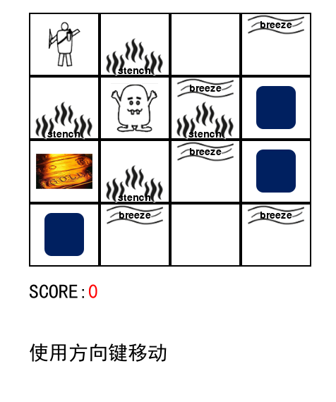
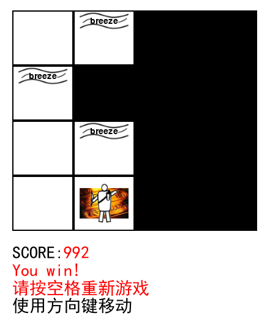

# wumpus

## 支持库
python3.5 pygame

## 运行代码


```bash
cd src
python main.py
```

## 编码规范


从c++时代，我们构建成员变量时候，变量前面加一个下划线代表数据，两个下划线代表实体存在，这样方便阅读，让别人也能容易看懂代码


- 数据: _data
- 显示内容: __hero


## 结构

文件 | 描述 
---------| ---------
LICENSE | 执照,限定转载需要说明
.gitignore | git提交过滤文件
README.md | 说明文件
src | 游戏源文件
┣ assets | 资源文件
┃ ┣ breeze.png | 微风图片
┃ ┣ favicon.ico | 游戏ico
┃ ┣ gold.png | 黄金图片
┃ ┣ hero.png | 英雄图片
┃ ┣ mist.png | 迷雾图片
┃ ┣ monster.png | 怪兽图片
┃ ┣ pit.png | 坑洞图片
┃ ┣ strench.png | 恶臭图片
┃ ┗ tile.png | 瓦片图片
┣ const.py | 常量
┣ game.py | 游戏逻辑
┣ item.py | 组件(地形,迷雾,英雄,感知)
┣ utils.py | 扩展组件,自定义layer以及render
┗ docs| 文档
  ┣ logic.md | 逻辑
  ┣ frame.md | 框架
  ┗ qa.md | 问题集合


## 游戏逻辑


[游戏逻辑](./docs/logic.md)


## 游戏框架


[游戏框架](./docs/frame.md)


## Q&A


[问答](./docs/qa.md)


# 巫普斯世界


Wumpus世界是一个简单的世界示例，基于角色扮演(RPG)游戏。它的灵感来自于1973年格里高里·尤布(Gregory Yob)的电子游戏《猎杀大亨》


Wumpus世界是一个洞穴，有4/4个房间，这些房间与通道相连。因此，共有16个房间相互连接。我们扮演一个英雄在这个世界上前进。这个山洞里有一间屋子，里面有个叫巫普斯(Wumpus)的怪兽，他会吃掉进屋的任何人。英雄可以射杀巫普斯，但英雄只有一支箭。在Wumpus世界中，有一些无底洞室，如果英雄落在深坑(pit)中，那么他将永远被困在那里。这个洞穴令人兴奋的是，在一个房间里有可能找到一大堆金子。因此，探员的目标是找到金子并爬出洞穴，而不会掉入坑或被Wumpus吞噬。如果特工用金子出来，他会得到奖励；如果被怪兽吞下或掉进坑里，他会受到惩罚。
注意：这里的Wumpus是静态的，不能移动。

以下是代表Wumpus世界的示例图。它显示了在世界(1，1)正方形位置上的一些带有坑的房间，带有Wumpus的一个房间和一个英雄。





Wumpus世界的计分说明


* 如果特工带着金从洞穴中出来，则可获得1000点奖励积分。
* 被Wumpus吃掉或掉进坑里的点数为-1000分。
* -1表示每个操作，-10表示使用箭头。
* 如果特工死亡或从山洞出来，游戏就会结束。





环境:

* 4 * 4的房间网格。
* 英雄最初位于房间正方形[1，1]中，朝向右侧。
* 除了第一个正方形[1, 1]以外，都是随机选择Wumpus和黄金的位置。
* 洞穴的每个正方形都可以是第一个正方形以外的概率为0.2的坑。


操作:

* 向左(left键或a键)
* 向右(left键或d键)
* 向上(left键或w键)
* 向下(left键或s键)
* 射箭(space空格键)
* 重新游戏(gameover状态下space空格键)


感觉信息:

* 与Wumpus房间相邻的房间很臭，因此会有些恶臭(strench)。
* 与PIT相邻的房间微风轻拂，因此，如果英雄到达PIT附近，则他会感觉到微风(breeze)。


Wumpus世界提示

- 部分可观察：Wumpus世界是部分可观察的，因为英雄只能感知附近的环境，例如相邻的房间。
- 确定性的：确定性的，因为世界的结果和结果是已知的。
- 顺序的：顺序很重要。
- 静态：由于Wumpus和坑不移动，它是静态的。
- 离散的：环境是离散的。


