# 游戏逻辑


结合游戏规则，程序实现也是有特定的逻辑


# 地形


4 * 4 的矩阵，凑成游戏的场景，每一个单元代表一个位置，英雄只能在这些单元行走，并且每个单元可能有陷阱怪物或者金条，还可以有有感知信息


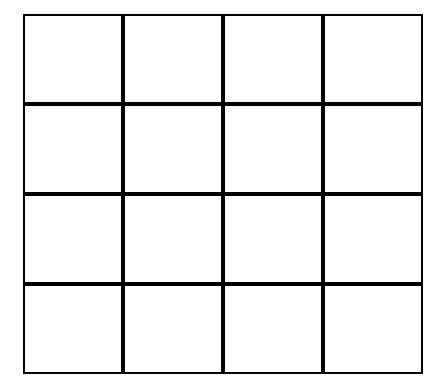

## 程序实现


我们使用numpy可以轻松构建二维矩阵


```python
import numpy as np
np.ones((LAYOUT.SIZE, LAYOUT.SIZE))
```


然后遍历数组，完成 4 * 4 个tile拼成一个terrain


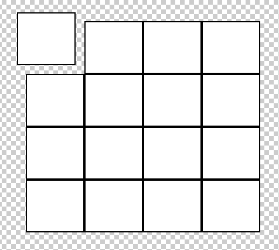


地形这块眼下只是一个装饰，给用户看出来可以走的位置，没有其他逻辑


> 如果之后改造成可以用户点击移动，可能会把tile做成鼠标经过以及点击时候都变色


# 英雄


可以在(4 * 4)的矩阵造成的地形(terrain)中行走


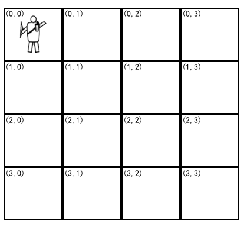


## 代码实现


(4 * 4)的矩阵是可以行走的位置，所以我们决定位置使用的行(m)和列(n)，然后根据行列计算出实际的x和y的pixel


上下左右移动都要判断一下是否在矩阵范围内


```py
class Hero(Layer):
  m = 0 # 横坐标
  n = 0 # 纵坐标
  def __init__(self):
    ...
  def pos(self, m, n):
    self.m = m
    self.n = n
    self.x = self.n * LAYOUT.TILE_WIDTH
    self.y = self.m * LAYOUT.TILE_HEIGHT
  def up(self):
    if self.m > 0:
      self.pos(self.m - 1, self.n)
  def down(self):
    if self.m < LAYOUT.SIZE - 1:
      self.pos(self.m + 1, self.n)
  def left(self):
    if self.n > 0:
      self.pos(self.m, self.n - 1)
  def right(self):
    if self.n < LAYOUT.SIZE - 1:
      self.pos(self.m, self.n + 1)
```

# 遭遇


在之前的 4 * 4 的矩阵，除了最开始的位置，以及开始上下两个位置，都可能存在黄金(1)、陷阱(3)、怪兽(1)


1. 黄金：拿到过关(game clear)
2. 怪兽：碰到游戏结束(game over)
3. 陷阱：碰到游戏结束(game over)


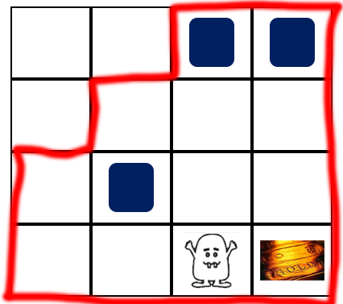


## 程序实现


我们需要在(4 * 4)的矩阵里随机生成黄金，怪兽，陷阱，并且不能重叠


方法很多种，我用的是先创建一个一维矩阵，然后再打乱，最后生成二维矩阵


```python
arr = np.zeros(4 * 4) # 生成一维矩阵，初始元素都是0
arr[0] = 1 # 分别加入1、2、3可以作为黄金，怪兽、陷阱
arr[1] = 2
arr[2] = 3
```


一维数组，最开始是1、2、3，其他是0
```bash
array([1., 2., 3., 0., 0., 0., 0., 0., 0., 0., 0., 0., 0., 0., 0., 0.])
```


我们使用随机打乱


```python
np.random.shuffle(arr) # 打乱
```


现在是打乱的一维矩阵


```bash
array([0., 0., 1., 0., 0., 3., 0., 0., 0., 0., 0., 0., 0., 0., 2., 0.])
```


我们重新做成二维矩阵


```py
arr.resize((4,4))
```


现在得到的是打乱的二维矩阵


```bash
array([[1., 0., 0., 0.],
       [0., 2., 0., 0.],
       [0., 0., 3., 0.],
       [0., 0., 0., 0.]])
```


但是有个问题，第一个位置，也就是左上角的位置(arr[0][0])是英雄出场的位置，不能有怪，也不能有黄金，实际上第一步可以走的位置也不能有(arr[1][0]和arr[0][1])


我最终的做法是，最开始创建一维数组时候，少这三个位置，然后再插入


```bash
data = np.ones( 4 * 4 -3 ) # 全是1的一维矩阵，测试空位置
data = np.insert(data, 0, 0) # 第一个主角出来的位置
data = np.insert(data, 1, 0) # 主角横着走的第一个位置
data = np.insert(data, 4, 0) # 主角竖着走的第一个位置
data.resize((4,4))
```


最终确定了这个位置不能有任何遭遇，不管是黄金还是怪兽或者坑洞


```bash
array([[0., 0., 1., 1.],
       [0., 1., 1., 1.],
       [1., 1., 1., 1.],
       [1., 1., 1., 1.]])
```


然后我们根据这个矩阵，放上金钱，怪兽和坑洞


1. 什么都没有 code = 0
2. 黄金 code = 10
3. 怪兽 code = 21
4. 坑洞 code = 22 总共3个


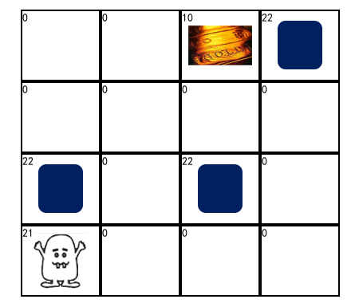


# 战争迷雾


用户走过的位置，是可视的，否则看不见的(黑色遮挡)


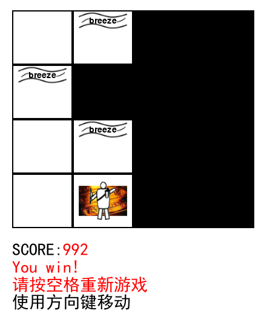


## 代码实现


这里逻辑比较简单，就是跟地形一样的矩阵，1代表有迷雾，0代表没有，只要走到的地方如果是1就改成0


```py
data = np.ones((4, 4))
def scan(m, n):
  if data[m][n] == 1:
    data[m][n] = 0
```


# 感知


因为战争迷雾的存在，没有探索(scan)到的地方，都是黑的，不知道是否有危险(怪物或坑洞)


所以怪物散发着臭气(strench)


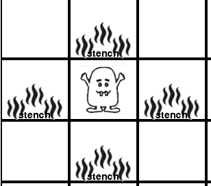


坑洞周围吹着微风(breeze)


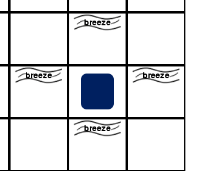


如果我们在(1, 0)闻见了臭气，那么怪物应该在(1, 1)或者(2, 0)。


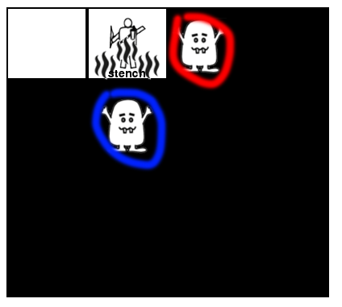


如果我们在(0, 1)感受到了微风，那么坑洞应该在(1, 1)或者(0, 2)。**还可能两个都有，因为坑洞有3个，怪物只有一个**


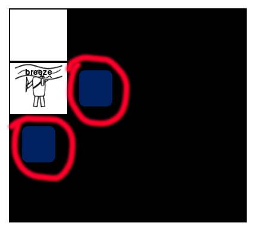


## 代码实现


我们需要用encounter的数据然后在code判断是怪物时候上下左右添加臭气(strench)，code判断是坑洞时候上下左右添加微分(breeze)


```py
for m, row in enumerate(data):
  for n, col in enumerate(row):
    self.warn(col, m - 1, n)
    self.warn(col, m + 1, n)
    self.warn(col, m, n - 1)
    self.warn(col, m, n + 1)
```


不过要注意一下逻辑，感知不能超出(4 * 4)矩阵，还要剔除所在位置已经有了遭遇的数据，所以我们这里用了感知数据(data)和遭遇数据(origin)一起来完成判断


```py
def warn(self, code, m, n):
  if code in [ENCOUNTER.MONSTER, ENCOUNTER.PIT] and m >= 0 and m < LAYOUT.SIZE and n >= 0 and n < LAYOUT.SIZE and self._origin[m][n] == 0:
    s = None
    if code == ENCOUNTER.MONSTER:
      s = Strench()
    elif code == ENCOUNTER.PIT:
      s = Breeze()
    if s:
      s.x = n * LAYOUT.TILE_WIDTH
      s.y = m * LAYOUT.TILE_HEIGHT
      self._data[m][n] = code
      self.add(s)
```


# 计分


我们的游戏是单回合的，输赢都会结束，没有累计


1. 英雄行动一次-1
2. 英雄射箭一次-10
3. 英雄被怪物吃掉-1000
4. 英雄掉入陷坑-1000
5. 英雄得到黄金+1000

## 代码实现


计分很简单，就是设置了分值，然后定义了一个函数(change)去改变分值


这里主要用到了字体，如果要显示中文，还要换一种可以显示中文的字体


```py
class Scoreboard(Layer):
  _score = 0 # 分数数据
  _font = None # 字体
  def __init__(self):
    self._font = pygame.font.SysFont('SimHei',28)
    ...
  def change(self, num):
    self._score += num
    self._font.render('%s' % self._score, True, (255,0,0))
    return self._score
```


为了方便维护，分数我们放在了常量


```py
SCORE = Const()
SCORE.WALK = -1 # 行走
SCORE.WIN = 1000 # 胜利
SCORE.LOSE = -1000 # 失败
SCORE.ATTACK = -10 # 攻击
```

# 游戏判定


这块单独拿出来说，因为逻辑上不难，但是代码实现上，需要多个模块一起联动


1. 英雄移动到黄金(gold)位置游戏通关(game clear)
2. 英雄移动到怪兽(monster)或者坑洞(pit)时候游戏结束(game over)
3. 英雄可以对临近的位置射箭，如果怪物(monster)在这个位置就可以杀死怪兽

## 代码实现


侦听hero的行动


```py
self.__hero = Hero() # 构造英雄
self.__hero.on(EVENT.HERO_WALK, self.onHeroWalk) # 侦听英雄行走
self.__hero.on(EVENT.HERO_ATTACK, self.onHeroAttack) # 侦听英雄攻击
```


在英雄行走的时候，计分(scoreboard)，打开战争迷雾(mists)，检测遭遇(encounter)


```py
def onHeroWalk(self, e):
  self.__scoreboard.change(SCORE.WALK) # 记分牌记录行走的积分
  self.__mists.scan(e.m, e.n) # 战争迷雾打开
  self.__encounter.hit(e.m, e.n) # 遭遇检测
```


遭遇检测，就是拿英雄走的位置跟遭遇数组做对比，不为0就是会有事发生


```py
def hit(self, m, n):
  code = self._data[m][n]
  if code == ENCOUNTER.GOLD: # 碰到黄金通关
    # 成功逻辑
  elif code == ENCOUNTER.MONSTER or code == ENCOUNTER.PIT: # 碰到怪兽或者坑洞失败
    # 失败逻辑
```


射箭同理，射箭触发之后判断


```py
def shot(self, m, n):
  code = self._data[m][n]
  if code == ENCOUNTER.MONSTER:
    self._data[m][n] = 0 # 怪兽死亡要清空位置所在数据
    # 怪兽死亡逻辑
    e = Event(EVENT.MONSTER_DEAD) # 发送怪物死亡事件
    self.dispatch(e)
```


刚才有个怪兽死亡事件，这个是为了让感知(smell)更新，因为恶臭(strench)已经不存在了


```py
self.__encounter.on(EVENT.MONSTER_DEAD, self.onMonsterDead) # 侦听怪兽死亡
def onMonsterDead(self, e):
  self.__smell.show(self.__encounter.getData()) # 让感知根据新的遭遇数据生成感知
```


# 总结


以上是所有程序逻辑，首先要整理真正的逻辑，然后想代码的逻辑，但是代码实现的时候要想很多逻辑之外的内容，主要是视觉方面


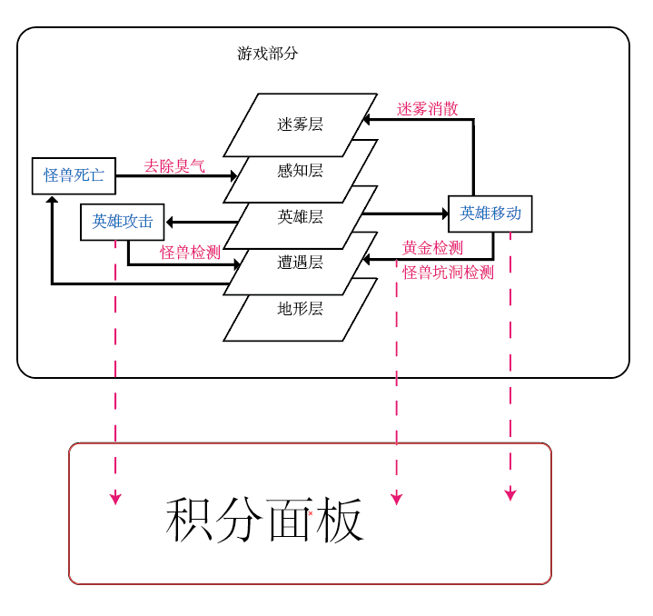